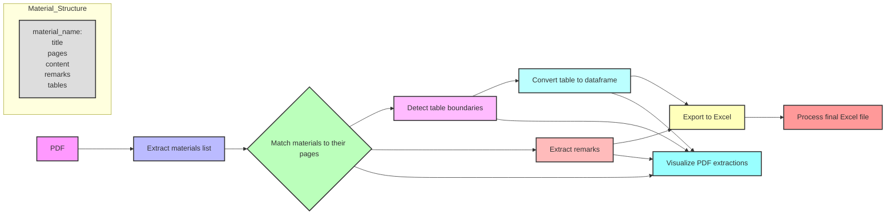

## About this project

Automatic extraction and processing of data (production volumes, reserves, etc.) from the Mineral Commodity Summaries (MCS) PDF file, as part of research on material risks and needs for major technological transitions.

## Projects pipeline



## Usage

1. **Prepare**
   - install required libraries using: pip install -r requirements.txt
   - Place the MCS PDF file (e.g., `mcs2024.pdf`) in the project root directory.

3. **Run the Notebook**
   - Open and run `main.ipynb` in Jupyter Notebook.

4. **Automatic Extraction**
   - The notebook will extract materials, tables, and remarks from the PDF.
   - Review the outputs at each step.

5. **Manual Review**
   - Check and correct `production_reserve_tables1.xlsx` if needed.
   - Save corrections as `production_reserve_tables1_updated_manually.xlsx`.

6. **Final Processing**
   - Run the remaining cells to process remarks and production data.
   - The final output will be saved as `final_table.xlsx`, which contains two sheets:
      - `2022 Data`: Production and reserves data for 2022
      - `2023 Data`: Production and reserves data for 2023
    
## Project sturcture:
```plaintext
.
├── test_usgs/
│   ├── .vscode/
│   ├── __pycache__/
│   ├── excel_output/    # Generated Excel files
│   ├── json_files/      # Generated JSON files
│   ├── pdf_output/      # Generated PDF files
│   ├── sub_materials_database.csv   # Alloy composition database
│   ├── .gitignore
│   ├── final_table.xlsx      # Processed output table
│   ├── generate_data.ipynb   
│   ├── main.ipynb            # Main script
│   ├── mcs2024.pdf           # Input PDF file
│   ├── requirements.txt      # Required libraries
│   └── utils.py              # Helper functions
└── readme.md
```
